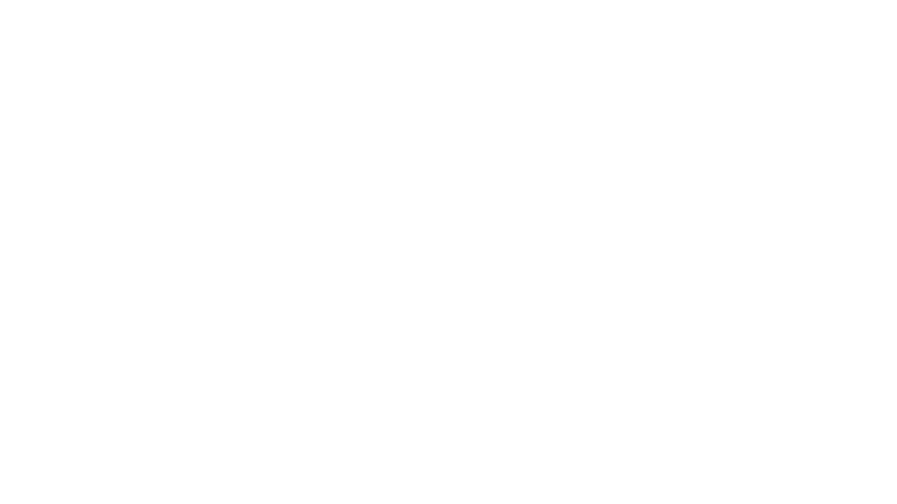

# SEA Catering - Healthy Meal Subscription Service

<div align="center">
  
  
  **A modern meal subscription platform built with Laravel, React, and Inertia.js**
  
  [](https://laravel.com)
  [](https://reactjs.org)
  [](https://www.typescriptlang.org)
  [](https://inertiajs.com)
  [](https://tailwindcss.com)
</div>

## 🌐 Overview

https://sea-catering-master-igspxr.laravel.cloud/

## 🌟 About SEA Catering

SEA Catering is a comprehensive meal subscription platform that connects health-conscious customers with customizable, nutritious meal plans. Our platform offers:

- **Personalized Meal Plans** - Choose from various subscription options tailored to your dietary needs
- **Flexible Management** - Pause, resume, or cancel subscriptions with ease
- **Quality Assurance** - Fresh, healthy meals delivered across Indonesia
- **Admin Dashboard** - Comprehensive analytics and subscription management
- **User Experience** - Intuitive interface for seamless meal planning

## ✨ Features

### 🏠 Landing Page
- **Hero Section** - Engaging introduction to SEA Catering services
- **Service Showcase** - Highlight key features and benefits
- **Customer Testimonials** - Real reviews from satisfied customers
- **Interactive Forms** - Easy testimonial submission for authenticated users

### 👤 User Dashboard
- **Subscription Overview** - View all active meal plans and details
- **Pause Subscriptions** - Temporarily pause deliveries with custom date ranges
- **Cancel Subscriptions** - Easy cancellation with confirmation process
- **Personal Management** - Track meal types, delivery days, and pricing

### 🔧 Admin Dashboard
- **Analytics Overview** - Key metrics and performance indicators
- **Date Range Filtering** - Analyze data within specific time periods
- **Subscription Metrics**:
  - New Subscriptions count
  - Monthly Recurring Revenue (MRR)
  - Reactivation statistics
  - Subscription growth tracking

### 🔐 Authentication System
- **User Registration** - Secure account creation with validation
- **Login/Logout** - Session management with role-based access
- **Email Verification** - Account verification for security
- **Password Management** - Reset and update functionality

### 📱 Responsive Design
- **Mobile-First** - Optimized for all device sizes
- **Modern UI** - Clean, intuitive interface with dark theme
- **Accessibility** - Following web accessibility standards

## 🛠 Technology Stack

### Backend
- **Laravel 12.x** - PHP framework for robust backend development
- **PostgreSQL** - Reliable database for data storage
- **Eloquent ORM** - Object-relational mapping for database interactions
- **Laravel Sanctum** - API authentication system

### Frontend
- **React 19.x** - Modern JavaScript library for user interfaces
- **TypeScript 5.7** - Type-safe JavaScript development
- **Inertia.js 2.x** - Single-page app without API complexity
- **Tailwind CSS 4.x** - Utility-first CSS framework

### Development Tools
- **Vite 6.x** - Fast build tool and development server
- **ESLint** - Code linting and quality assurance
- **Prettier** - Code formatting
- **TypeScript** - Static type checking

## 📋 Prerequisites

Before you begin, ensure you have the following installed:

- **PHP** >= 8.2
- **Composer** - Dependency manager for PHP
- **Node.js** >= 18.x
- **npm** or **yarn** - Package manager for JavaScript
- **PostgreSQL** >= 13.x - Database server
- **Git** - Version control system

## 🚀 Installation

### 1. Clone the Repository

```bash
git clone https://github.com/your-username/sea-catering.git
cd sea-catering
```

### 2. Install PHP Dependencies

```bash
composer install
```

### 3. Install JavaScript Dependencies

```bash
npm install
```

### 4. Environment Configuration

```bash
# Copy environment file
cp .env.example .env

# Generate application key
php artisan key:generate
```

### 5. Database Setup

Configure your database connection in `.env`:

```env
DB_CONNECTION=pgsql
DB_HOST=127.0.0.1
DB_PORT=5432
DB_DATABASE=sea_catering
DB_USERNAME=your_username
DB_PASSWORD=your_password
```

### 6. Run Migrations and Seeders

```bash
# Run database migrations
php artisan migrate

# Seed the database with sample data
php artisan db:seed
```

### 7. Storage Linking

```bash
php artisan storage:link
```

### 8. Start Development Servers

For development with hot reloading:

```bash
# Using the built-in composer script
composer run dev

# Or manually run both servers
php artisan serve
npm run dev
```

## 🗄 Database Schema

### Users Table
```sql
- id (Primary Key)
- name (String)
- email (String, Unique)
- password (Hashed String)
- role (String: 'user', 'admin')
- email_verified_at (Timestamp)
- created_at, updated_at (Timestamps)
```

### Meal Plans Table
```sql
- id (Primary Key)
- name (String)
- description (Text)
- price (Decimal)
- duration_days (Integer)
- created_at, updated_at (Timestamps)
```

### Subscriptions Table
```sql
- id (Primary Key)
- user_id (Foreign Key)
- meal_plan_id (Foreign Key)
- name (String)
- phone (String)
- plan (String)
- meal_types (JSON)
- delivery_days (JSON)
- allergies (Text, Nullable)
- total_price (Decimal)
- status (String)
- paused_from, paused_until (Timestamps, Nullable)
- cancelled_at, reactivated_at (Timestamps, Nullable)
- created_at, updated_at (Timestamps)
```

### Testimonials Table
```sql
- id (Primary Key)
- user_id (Foreign Key)
- name (String)
- review (Text)
- rating (Integer)
- created_at, updated_at (Timestamps)
```

## 👥 Default User Accounts

The application comes with pre-configured accounts for testing:

### Admin Account
```
Email: admin@seacatering.com
Password: admin123
Role: admin
```

### Test User Account
```
Email: user@seacatering.com
Password: password
Role: user
```

## 🔗 API Routes

### Public Routes
- `GET /` - Landing page
- `GET /contact` - Contact page
- `GET /login` - Login page
- `POST /login` - Authenticate user
- `GET /register` - Registration page
- `POST /register` - Create new account

### Authenticated User Routes
- `GET /dashboard` - User dashboard
- `POST /subscription/{id}/pause` - Pause subscription
- `POST /subscription/{id}/cancel` - Cancel subscription
- `POST /testimonials` - Submit testimonial

### Admin Routes
- `GET /admin/dashboard` - Admin analytics dashboard

## 🧪 Testing

Run the test suite:

```bash
# Run all tests
php artisan test

# Run with coverage
php artisan test --coverage
```

## 🚀 Deployment

### Production Build

```bash
# Build assets for production
npm run build

# Optimize Laravel for production
php artisan config:cache
php artisan route:cache
php artisan view:cache
```

### Environment Variables for Production

```env
APP_ENV=production
APP_DEBUG=false
APP_URL=https://your-domain.com

# Database configuration
DB_CONNECTION=pgsql
DB_HOST=your-production-host
DB_DATABASE=your-production-database

# Add your production-specific configurations
```

## 📁 Project Structure

```
sea-catering/
├── app/
│   ├── Http/
│   │   ├── Controllers/
│   │   │   ├── Auth/                 # Authentication controllers
│   │   │   ├── AdminDashboardController.php
│   │   │   ├── DashboardController.php
│   │   │   ├── TestimonialController.php
│   │   │   └── WelcomeController.php
│   │   ├── Middleware/
│   │   │   └── AdminMiddleware.php    # Admin access control
│   │   └── Requests/                  # Form request validation
│   ├── Models/
│   │   ├── User.php
│   │   ├── MealPlan.php
│   │   ├── Subscription.php
│   │   └── Testimonial.php
├── database/
│   ├── migrations/                    # Database schema
│   ├── seeders/                       # Sample data
│   └── factories/                     # Model factories
├── resources/
│   ├── js/
│   │   ├── components/               # React components
│   │   ├── layouts/                  # Page layouts
│   │   ├── pages/                    # Page components
│   │   └── types/                    # TypeScript type definitions
│   └── views/
│       └── app.blade.php             # Main application template
├── routes/
│   ├── web.php                       # Web routes
│   ├── auth.php                      # Authentication routes
│   └── settings.php                  # Settings routes
└── public/
    └── storage/
        └── assets/                   # Public assets (images, etc.)
```

## 🤝 Contributing

We welcome contributions to SEA Catering! Please follow these guidelines:

1. **Fork the repository**
2. **Create a feature branch** (`git checkout -b feature/amazing-feature`)
3. **Commit your changes** (`git commit -m 'Add some amazing feature'`)
4. **Push to the branch** (`git push origin feature/amazing-feature`)
5. **Open a Pull Request**

### Development Guidelines

- Follow PSR-12 coding standards for PHP
- Use TypeScript for all React components
- Write tests for new features
- Update documentation as needed
- Ensure all tests pass before submitting
